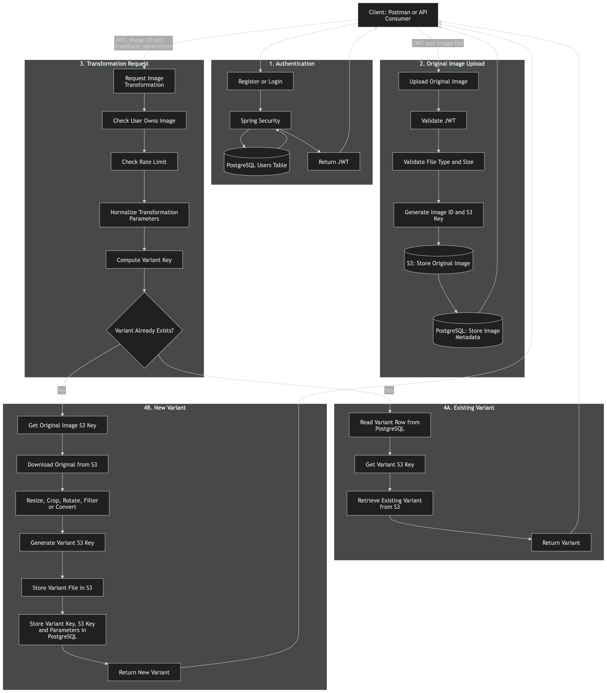

# Image Processing Service

A backend API for uploading, storing, and transforming images using Java and Spring Boot.
Project spec: Users authenticate with JWT, upload images to cloud storage, and (in progress) request transformed variants (resize, crop, rotate, filters) with caching and rate limiting.

## Tech Stack

| Layer                | Technology                  |
| -------------------- | --------------------------- |
| Language / Framework | Java 17, Spring Boot        |
| Security             | Spring Security, JWT (JJWT) |
| Database             | PostgreSQL                  |
| ORM                  | Spring Data JPA             |
| Object storage       | AWS S3 (AWS SDK v2)         |
| Caching              | Redis.                      |
| Validation           | Jakarta Bean Validation     |
| Build                | Maven                       |

## Architecture



The service follows a layered architecture with a clear separation of concerns:

- **Controller → Service → Repository** — controllers stay thin (HTTP parsing, auth context, responses); business logic lives in services; persistence is isolated in repositories.
- **Storage abstraction** — all AWS S3 interaction is isolated behind a single `S3StorageService`; nothing else in the codebase touches the AWS SDK directly.
- **Stateless JWT authentication** — a custom `JwtAuthenticationFilter` validates bearer tokens and populates Spring Security's context; no sessions.
- **DTOs at the API boundary** — request/response contracts are separate from JPA entities.
- **Centralized error handling** — a single `@RestControllerAdvice` maps domain exceptions to HTTP status codes.
- **Content-addressed storage keys** — image/variant object keys are generated server-side (never from user-supplied filenames), designed around deterministic variant keys so identical transform requests can reuse existing output instead of reprocessing.

More detailed flow diagrams (auth, upload, and the planned transform/caching flow) are in [`diagrams/`](diagrams/).

## Features

**Implemented**

- User registration and login with JWT issuance
- JWT-secured endpoints via a custom Spring Security filter
- Image upload (multipart) with file type/size validation, stored in S3 with metadata persisted in PostgreSQL

**Planned**

- Image transformations (resize, crop, rotate, filters, format conversion) with variant caching
- Rate limiting on transformation requests
- Paginated image listing and retrieval

## Running Locally

Requires Java 17, PostgreSQL, and an AWS account/bucket.

```bash
export DB_USERNAME=...
export DB_PASSWORD=...
export JWT_SECRET=$(openssl rand -hex 32)
export AWS_PROFILE=...
export AWS_S3_BUCKET=...
export AWS_REGION=...

./mvnw spring-boot:run
```
